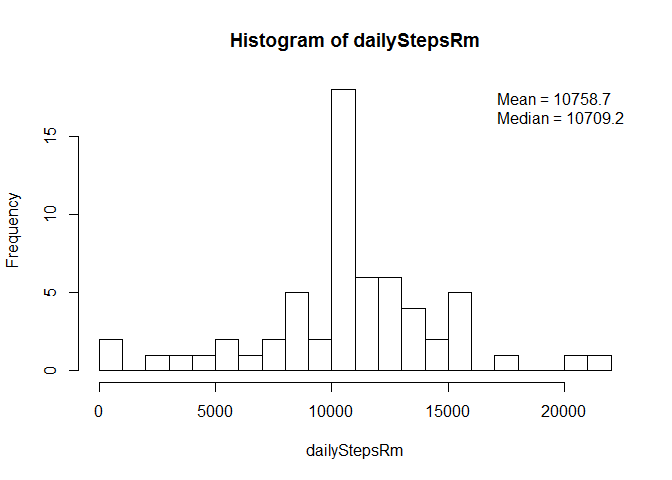

Loading and preprocessing the data
==================================

    knitr::opts_chunk$set(echo = TRUE)

    ### Load the data 
    unzip("./activity.zip", "activity.csv")
    file = read.csv("./activity.csv", header=TRUE)
    str(file)

    ## 'data.frame':    17568 obs. of  3 variables:
    ##  $ steps   : int  NA NA NA NA NA NA NA NA NA NA ...
    ##  $ date    : Factor w/ 61 levels "2012-10-01","2012-10-02",..: 1 1 1 1 1 1 1 1 1 1 ...
    ##  $ interval: int  0 5 10 15 20 25 30 35 40 45 ...

    ###Process/transform the data (if necessary) into a format suitable for your analysis
    file$date <- as.Date(file$date)

What is mean total number of steps taken per day?
=================================================

    knitr::opts_chunk$set(echo = TRUE)

    ### Calculate the total number of steps taken per day
    dailySteps <- tapply(file$steps, file$date, sum, na.rm=TRUE)
    str(dailySteps)

    ##  int [1:61(1d)] 0 126 11352 12116 13294 15420 11015 0 12811 9900 ...
    ##  - attr(*, "dimnames")=List of 1
    ##   ..$ : chr [1:61] "2012-10-01" "2012-10-02" "2012-10-03" "2012-10-04" ...

### Make a histogram of the total number of steps taken each day

    #### Mean number of steps per day
    myMean <- mean(dailySteps)
    #### Median number of steps per day
    myMedian <- median(dailySteps)

    ### Histogram, Median and Mean
    hist(dailySteps, 25)
    legend('topright', legend = c(paste("Mean =", round(myMean, 1)),paste("Median =",round(myMedian, 1))), bty = "n")

<!-- -->

What is the average daily activity pattern?
===========================================

    ###Time Series Plot

    activity<-tapply(file$steps, file$interval, mean, na.rm=T)
    plot(y = activity, x = names(activity), type = "l", xlab = "Nth 5 Minute Interval", main = "Daily Activity", ylab = "Avg. Num. Steps")

    max_dim <- activity[which.max(activity)]
    first <- round(as.numeric(levels(as.factor(max_dim))), 2)
    second <- names(max_dim)
    legend('topright', legend = c(paste("Time Interval: ", second),paste("Max Avg Steps: ",first)))
    abline(v = as.numeric(names(max_dim)), col = 'red')

<!-- -->

Imputing missing values
=======================

#### The total number of missing values is

    sum(is.na(file$steps))

    ## [1] 2304

    ##which(is.na(file$steps))

Replacing 'NA' values with AVG Values per day, given the appropriate
date of the 'NA'...

    copy <- file
    copy$steps <- ifelse(is.na(copy$steps) == TRUE, as.numeric(levels(as.factor(activity)))[as.numeric(names(activity)) %in% copy$interval], copy$steps)
    #df1$B <- ifelse(is.na(df1$B) == TRUE, df2$B[df2$A %in% df1$A], df1$B) 

Histogram after Removed
-----------------------

    dailyStepsRm <- tapply(copy$steps, copy$date, sum, na.rm = TRUE)

    #### Mean number of steps per day
    myMeanRm <- mean(dailyStepsRm)
    #### Median number of steps per day
    myMedianRm <- median(dailyStepsRm)

    hist(dailyStepsRm, 25)
    legend('topright', legend = c(paste("Mean =", round(myMeanRm, 1)),paste("Median =",round(myMedianRm, 1))), bty = "n")

<!-- -->

    myMeanRm

    ## [1] 10758.71

weekends vs weekdays
====================

### you can see a skew for weekdays

    weekday <- copy[!(weekdays(copy$date) %in% c('Saturday', 'Sunday')),]
    weekend <- copy[weekdays(copy$date) %in% c('Saturday', 'Sunday'),]

    wd_activity <- tapply(weekday$steps, weekday$interval, mean)
    we_activity <- tapply(weekend$steps, weekend$interval, mean)
    par(mfrow=c(2,1))
    plot(wd_activity, type="l", main="Weekdays", xlab="Nth 5min Interval", ylab="Avg Steps")
    plot(we_activity, type="l", main="Weekends", xlab="Nth 5min Interval", ylab="Avg Steps")

<!-- -->
